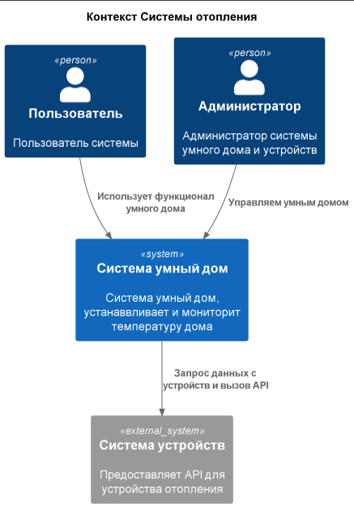
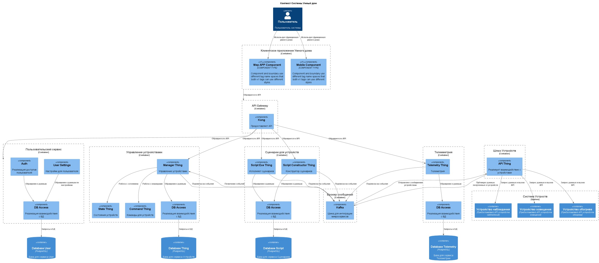
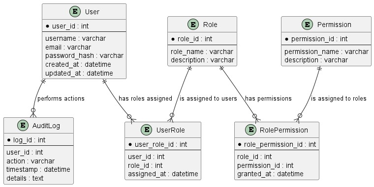
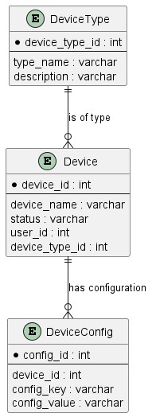
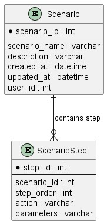
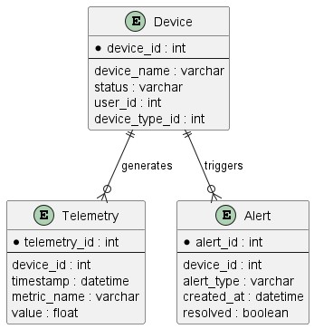

# Описание
## Архитектура As Is

Диаграмма контектса

[C4](./docs/1.1.puml)

## Домены
Управление отоплением:
    Пользователи могут удалённо включать/выключать отопление в своих домах.
    Пользователи могут устанавливать желаемую температуру.
    Система автоматически поддерживает заданную температуру, регулируя подачу тепла.
Мониторинг температуры:
    Система получает данные о температуре с датчиков, установленных в домах.
    Пользователи могут просматривать текущую температуру в своих домах через веб-интерфейс.

## Техническое описание:
Язык программирования: Java

База данных: PostgreSQL

Архитектура: Монолитная, все компоненты системы (обработка запросов, бизнес-логика, работа с данными) находятся в рамках одного приложения.

Взаимодействие: Синхронное, запросы обрабатываются последовательно.

Масштабируемость: Ограничена, так как монолит сложно масштабировать по частям.

Развертывание: Требует остановки всего приложения.

## Плюсы решения:

Простота разработки и тестирования

Цельность системы

Единое окружение 

Производительность

Единственная база данный (упращает поддержку)

## Минусы решения:

Ограниченная масштабируемость

Сложность в развертывании и обновлении


## Архитектура To Be
### Архитектура
 Язык программирования: **Java**

 База данных: **PostgreSQL**

 Архитектура: **Микросервисная**

 Взаимодействие: **Асинхронное** через шину(Kafka)
 Масштабируемость: **Предусмотрено**, 
 Развертывание: **Микросервисами**



[C4](./docs/1.2.puml)

## ER
Database User [ER](./docs/1.3_user.puml)



Database Thing [ER](./docs/1.3.puml)



Database Script [ER](./docs/1.3_scr.puml)



Database Telemetry [ER](./docs/1.3_tel.puml)



# Описание взаимодействия
[Описание API в формате AsyncAPI](./docs/asyncapi.yaml)

# Управление устройствами и Телеметрия 1.0.0 documentation

* Support: [Команда разработчиков](https://example.com)
* Email support: [support@example.com](mailto:support@example.com)

API для взаимодействия между сервисами "Управление устройствами" и "Телеметрия" в формате AsyncAPI.


## Table of Contents

* [Servers](#servers)
    * [production](#production-server)
* [Operations](#operations)
    * [PUB device/registration](#pub-deviceregistration-operation)
    * [SUB device/registration](#sub-deviceregistration-operation)
    * [PUB telemetry/data](#pub-telemetrydata-operation)
    * [SUB telemetry/data](#sub-telemetrydata-operation)

## Servers

### `production` Server

* URL: `kafka.example.com:9092`
* Protocol: `kafka`


#### Security

##### Security Requirement 1

* security.protocol: PLAINTEXT


## Operations

### PUB `device/registration` Operation

*Регистрация устройства*

* Operation ID: `registerDevice`

Канал для сообщений о регистрации устройства

#### Message `<anonymous-message-1>`

* Content type: [application/json](https://www.iana.org/assignments/media-types/application/json)

##### Payload

| Name | Type | Description | Value | Constraints | Notes |
|---|---|---|---|---|---|
| (root) | object | - | - | - | **additional properties are allowed** |
| device_id | string | Уникальный идентификатор устройства | - | - | - |
| device_type | string | Тип устройства | - | - | - |
| owner_id | string | Идентификатор владельца устройства | - | - | - |

> Examples of payload _(generated)_

```json
{
  "device_id": "string",
  "device_type": "string",
  "owner_id": "string"
}
```


### SUB `device/registration` Operation

*Получение сообщений о регистрации устройства*

* Operation ID: `receiveDeviceRegistration`

Канал для сообщений о регистрации устройства

#### Message `<anonymous-message-2>`

* Content type: [application/json](https://www.iana.org/assignments/media-types/application/json)

##### Payload

| Name | Type | Description | Value | Constraints | Notes |
|---|---|---|---|---|---|
| (root) | object | - | - | - | **additional properties are allowed** |
| status | string | Статус регистрации | - | - | - |
| device_id | string | Уникальный идентификатор устройства | - | - | - |
| message | string | Описание результата регистрации | - | - | - |

> Examples of payload _(generated)_

```json
{
  "status": "string",
  "device_id": "string",
  "message": "string"
}
```


### PUB `telemetry/data` Operation

*Отправка телеметрических данных*

* Operation ID: `sendTelemetryData`

Канал для передачи телеметрических данных

#### Message `<anonymous-message-3>`

* Content type: [application/json](https://www.iana.org/assignments/media-types/application/json)

##### Payload

| Name | Type | Description | Value | Constraints | Notes |
|---|---|---|---|---|---|
| (root) | object | - | - | - | **additional properties are allowed** |
| device_id | string | Уникальный идентификатор устройства | - | - | - |
| timestamp | string | Временная метка данных | - | format (`date-time`) | - |
| data | object | Телеметрические данные | - | - | **additional properties are allowed** |
| data.temperature | number | Температура устройства | - | - | - |
| data.humidity | number | Влажность устройства | - | - | - |

> Examples of payload _(generated)_

```json
{
  "device_id": "string",
  "timestamp": "2019-08-24T14:15:22Z",
  "data": {
    "temperature": 0,
    "humidity": 0
  }
}
```


### SUB `telemetry/data` Operation

*Получение телеметрических данных*

* Operation ID: `receiveTelemetryData`

Канал для передачи телеметрических данных

#### Message `<anonymous-message-4>`

* Content type: [application/json](https://www.iana.org/assignments/media-types/application/json)

##### Payload

| Name | Type | Description | Value | Constraints | Notes |
|---|---|---|---|---|---|
| (root) | object | - | - | - | **additional properties are allowed** |
| device_id | string | Уникальный идентификатор устройства | - | - | - |
| timestamp | string | Временная метка данных | - | format (`date-time`) | - |
| data | object | Телеметрические данные | - | - | **additional properties are allowed** |
| data.temperature | number | Температура устройства | - | - | - |
| data.humidity | number | Влажность устройства | - | - | - |

> Examples of payload _(generated)_

```json
{
  "device_id": "string",
  "timestamp": "2019-08-24T14:15:22Z",
  "data": {
    "temperature": 0,
    "humidity": 0
  }
}
```


# Базовая настройка

## Запуск minikube

[Инструкция по установке](https://minikube.sigs.k8s.io/docs/start/)

```bash
minikube start
```
## Запуск деплоя
```bash
cd deploy
 ./deploy.sh 
```
